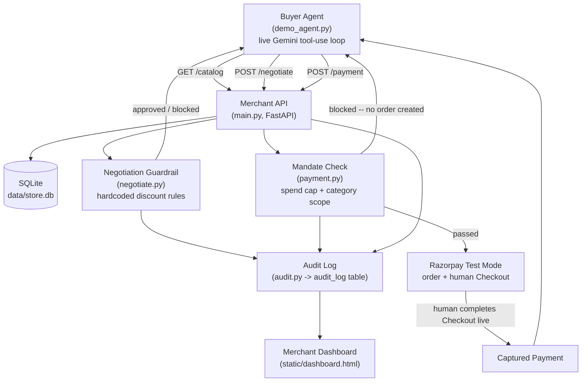
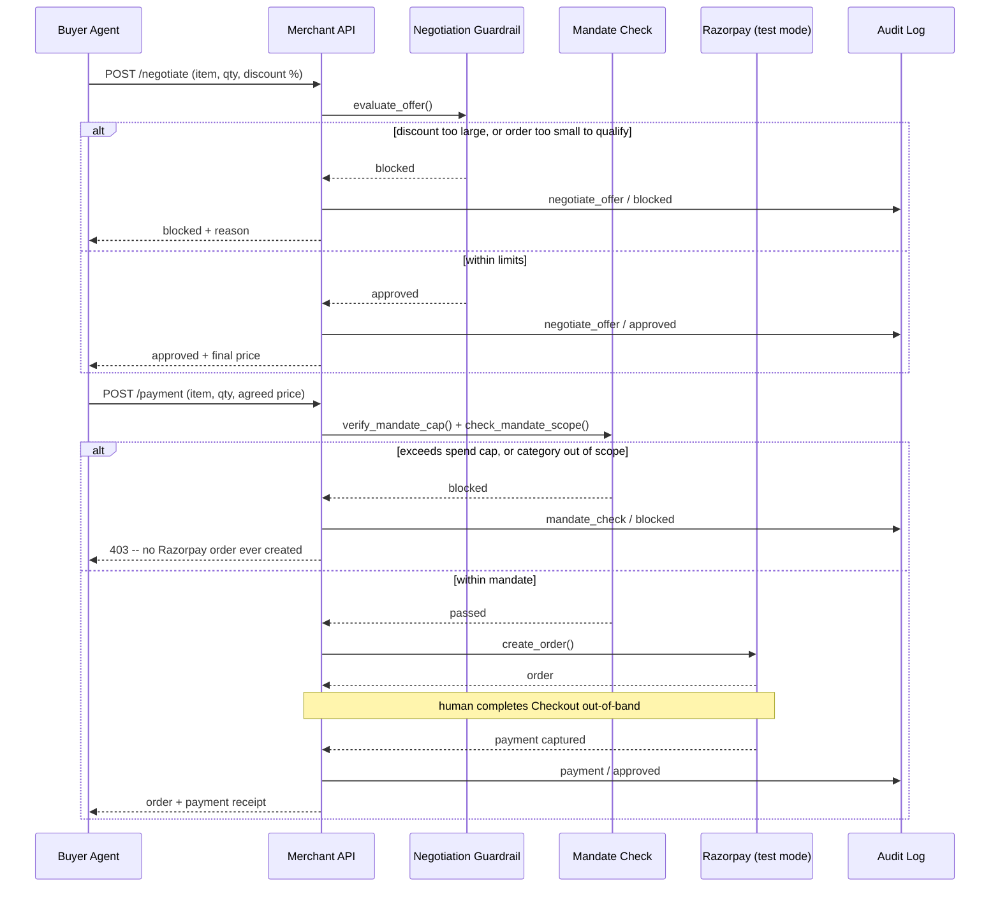

# Time & Co. — Agentic Commerce Reference Implementation


An AI-readiness layer for merchants, built for Razorpay Hackathon Track 1. Time & Co. is a reference merchant — a real stationery shop's messy raw catalog, enriched by an LLM into structured data an AI buyer agent can browse, negotiate against, and pay through. The point isn't the buyer agent; it's the merchant-side contract that makes any merchant AI-transactable: a browsable catalog, a negotiation surface with real guardrails, a spend mandate the merchant enforces (not the agent), and a full audit trail of every AI-driven decision.

## How it works

A buyer agent (in this repo, a live Gemini model given tool access) receives a plain-language purchase request and decides for itself how to fulfill it, using three endpoints as its only tools:

1. **Browse the catalog** — real items, real prices, real stock. Nothing is invented; the agent only ever acts on what the API actually returns.
2. **Negotiate** — the agent may request a discount. Whether it's granted is decided by a hardcoded rule in `negotiate.py`, never by the LLM. The model only explains the decision in plain English after the fact.
3. **Pay** — before any money moves, the request is checked against the buyer's mandate: a spend cap and a category scope, set by the merchant and stored server-side. If it fails either check, no Razorpay order is ever created. If it passes, a real Razorpay test-mode order is created and a human completes Checkout live (Razorpay has no server-to-server way to finish a payment, even in test mode).

Every one of these steps — catalog query, negotiation, mandate check, payment — is written to an audit log, timestamped and attributed, and rendered live on a merchant-facing dashboard.

Two guardrails matter here and are deliberately kept distinct, because they are different checks at different stages:

| | Negotiation guardrail | Mandate check |
|---|---|---|
| Enforces | Discount rules | Spend cap + category scope |
| Runs at | `/negotiate` | `/payment`, before Razorpay is contacted |
| Rule | Discount only granted if the order clears ₹10,000 and the request is at most 5% off | Order total must not exceed the mandate's spend cap; item category must fall within its category scope |
| Blocks | A discount request that's too generous | A purchase that's simply too large or out of scope, discount or not |

A run can be blocked by either one, or neither, depending on what the agent decides to ask for — that's a live model decision, not a script.

## Architecture



Every box on the right side of that diagram is a real, running check — nothing here is a mock decision layer. The two guardrails sit at different points in the request lifecycle on purpose, since they're answering different questions:



A request that never negotiates and stays within the mandate never touches either guardrail's blocked path. A request can also fail the negotiation guardrail before a mandate check is ever reached, or clear negotiation and still fail the mandate check — which guardrail (if either) fires depends on what the agent actually asks for, not a scripted sequence.

## Project structure

```
main.py            FastAPI app: routes, mounts the dashboard, wires everything together
models.py           SQLAlchemy schema (CatalogItem, Mandate, AuditLog) — frozen, do not modify
seed.py              One-time script: seeds 15 raw SKUs and one mandate
enrich.py            LLM enrichment logic for a single catalog item
run_enrichment.py    One-time script: runs enrich.py over every seeded item
negotiate.py         Guardrail rules + negotiation logic (deterministic, not LLM-decided)
payment.py           Razorpay test-mode wrapper: order creation, mandate verification, payment polling
checkout.py          Human-in-the-loop Checkout flow: serves the payment page, waits for completion
audit.py             Writes every AI-driven or money-adjacent decision to the audit log
llm.py               Shared Gemini API client: model selection, retry and fallback on transient failures
demo_agent.py        Test harness: an autonomous LLM tool-use loop that drives the three endpoints
console_ui.py        Terminal presentation layer for demo_agent.py — rendering only, no logic
data/store.db        SQLite database (catalog, mandates, audit log)
static/dashboard.html  Live merchant-facing AI Activity dashboard, polls /audit-log
storefront/           Time & Co.'s public storefront page — the reference merchant's own site
```

## Setup

Requirements: Python 3, a Gemini API key, and a Razorpay test-mode key pair.

```
python3 -m venv .venv
source .venv/bin/activate
pip install -r requirements.txt
```

Copy `.env.example` to `.env` and fill in:

```
GEMINI_API_KEY=
RAZORPAY_KEY_ID=
RAZORPAY_KEY_SECRET=
```

Seed and enrich the catalog once, before the first run:

```
python seed.py
python run_enrichment.py
```

This populates `data/store.db` with 15 SKUs and one mandate (`spend_cap=15000`, `category_scope=["stationery"]`), and runs each item through the LLM enrichment pass once — `GET /catalog` only ever reads what's already stored; it never calls the LLM live per request.

## Running it

Two processes: the merchant backend, and the buyer agent.

**Terminal 1 — backend and dashboard**

```
uvicorn main:app --reload
```

Open `http://localhost:8000/` for the live AI Activity dashboard. It polls `/audit-log` every two seconds and fills in as the agent runs.

**Terminal 2 — the buyer agent**

```
python demo_agent.py
```

Run with no arguments, it prompts for what to run:

```
1) Happy path demo (verified: blue pens, within mandate)
2) Failure path demo (verified: bulk sticky notes, trips a guardrail)
3) Type your own buy request
```

Or skip the prompt:

```
python demo_agent.py --happy
python demo_agent.py --failure
python demo_agent.py "buy 3 packs of blue pens"
```

On a run that reaches payment, a checkout link is printed and opened automatically in the default browser. Complete it with a Razorpay test card — for example `4100 2800 0000 1007`, any future expiry, any CVV, and a random 4–10 digit OTP — to capture the payment and see the final receipt.

Because the agent decides everything itself from a single instruction (it has no way to ask a follow-up question mid-run), a custom request should state what matters — quantity included — rather than leaving it to be inferred.

## API reference

| Method | Path | Purpose |
|---|---|---|
| `GET` | `/` | Merchant AI Activity dashboard |
| `GET` | `/catalog` | Enriched catalog: id, name, description, category, tags, price, stock |
| `POST` | `/negotiate` | Propose an order and discount; returns approved/blocked with the final price and reason |
| `POST` | `/payment` | Attempt payment; checked against the mandate before Razorpay is ever contacted |
| `GET` | `/audit-log` | Full timeline of every logged decision, oldest first |

## Notes

- The LLM model used for enrichment, negotiation explanations, and the buyer agent's tool-use loop is Gemini Flash, selected empirically by measured availability rather than a fixed choice — see `llm.py` for the current model and fallback order. Calls retry with backoff on transient 429/5xx responses before falling back to an alternate model.
- Payment completion cannot be automated end-to-end: Razorpay's Checkout requires a human to click through a real bank-page simulation, even in test mode, by design.
- The seeded mandate (`id=1`) is a single one-time spend cap, not a running balance — there is no notion of cumulative spend across multiple purchases in this build.

## Known limitations

Scoped deliberately for a hackathon build, not overlooked:

- No authentication on the API. `main.py`'s endpoints are open — anyone who can reach the server can call them. Fine for a local demo against test-mode payments; not how this would ship.
- No automated end-to-end test suite. `test_negotiate_logic.py` is a hand-written sanity check for `evaluate_offer()`'s branching logic only, run against made-up prices, not the real seeded catalog — it proves the guardrail's own rule logic is internally consistent, nothing more.
- No CI. Every verification in this repo's history was a manual diff review plus a live run, not an automated pipeline.
- Single merchant, single mandate, single buyer agent. There's no multi-tenant story here — one seeded `Mandate` row, one hardcoded `agent_id`.
- The buyer agent can't ask a clarifying question mid-run. It gets one plain-language request and has to decide everything itself in that single pass — including inferring a quantity if the request didn't state one.
